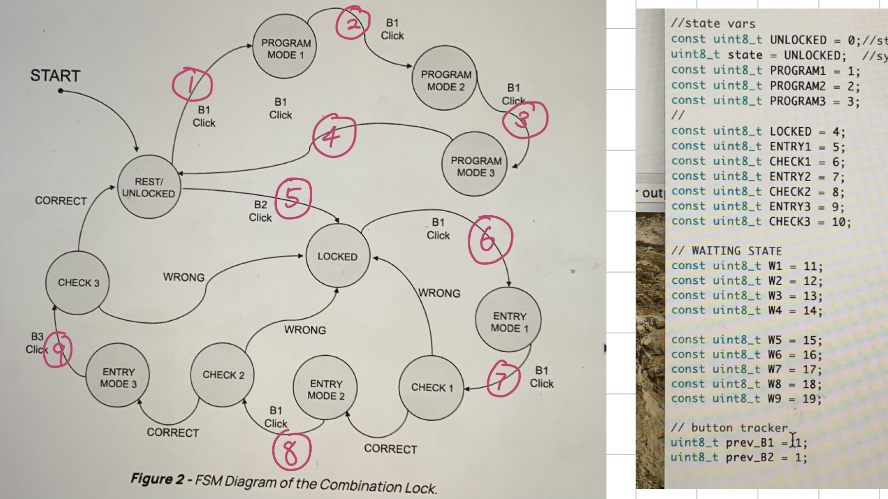

# Overview

This is a writeup for the Combo Clock design exercise. I will discuss the state machine I constructed and how it is slightly different from the one on the instruction page. I will also discuss how I enable the general "lock" behavior using IMU gyroscopic information and others. The details are discussed below.

[demonstration video](https://youtu.be/Iy1VaJ8xs00)


# Summary

## Finite State Machine of the Combination Lock

I mostly follow the diagram provided on the instruction page to implement FSM's desired behavior. One improvement I made was to add waiting states each after a button click, as shown, to ensure we correctly take a button press exactly once.

## Construct General "lock" Behavior
I take the advantage of IMU's gyroscopic to implement the lock behavior.
The general idea is that, when rotate clockwise, IMU z-axis gyroscopic data will read negative values. When rotate counterclockwise, the value reading is positive. I enable the "lock" behavior by setting a threshold of -5 or 5 depending on if it's in a clockwise or counter-clockwise program/entry state. Here's an example:

```
imu.readGyroData(imu.gyroCount);
      z = imu.gyroCount[2] * imu.gRes;
      if (z < -5){ 
        CW_counter = (CW_counter + 1) %11;
        tft.fillScreen(TFT_BLACK);
        tft.setCursor(0, 0, 1);
        sprintf(output, "%i %i %i", password[0], password[1], CW_counter);
        tft.println(output);
        }
```
Three PROGRAM states and three ENTRY states all use a very similar approach as shown to set the password number, except they update different arrays, `password` for setting password and `entry` for attempting to unlock. While still rotating, 

```if (z<-5) for CW or if (z>5) for CCW
```

I increment the counter by 1. Since the number range from 0 to 10, I have a module 11 to ensure the number will circulate. To enable the correct bahavior, the counter is set to 0 everytime we press button 1 in a waiting state. ie:

```
if(prev_B1 == 0 && button1 == 1){
        prev_B1 = 1;
        state = PROGRAM3; //go to program 1
        CCW_counter = 0;
        }
```
Note that a waiting state also handles the storage of a number entry either to `password` or `entry`.

Three CHECK states also share very similar logics, where they check if  `entry[i] == password[i]` in which `i` depends on which entry we are now checking.


## Ending
In conclusion, most of the works is done in the big finite state machine, as implemented in `void combo_fsm(uint8_t button1, uint8_t button2)`. States in similar category (ie. PROGRAM, ENTRY, CHECK) each shares similar logics.
